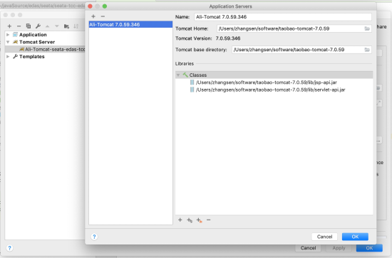
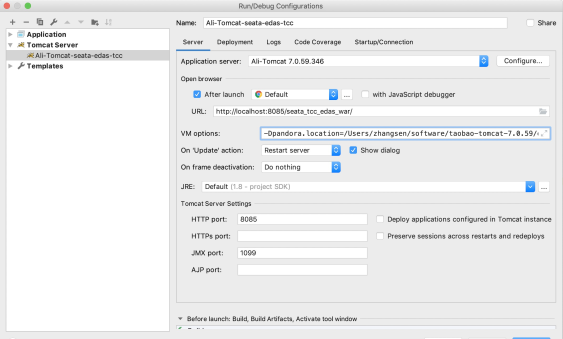
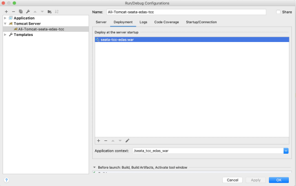

# Seata 在edas 环境demo 运行指南

# 

### 1、安装edas的轻量级配置及注册中心

安装和启动方式详见阿里云官网：[https://help.aliyun.com/document_detail/44163.html](https://help.aliyun.com/document_detail/44163.html?spm=a2c4g.11186623.6.587.6c566d3dNn3qyc) 

### 2、安装 Ali-Tomcat 和 Pandora

安装文档详见阿里云官网：[https://help.aliyun.com/document_detail/99410.html](https://help.aliyun.com/document_detail/99410.html) 的“安装 Ali-Tomcat 和 Pandora” 部分；

### 3、查看本模块 demo

### 4、配置IDE 环境

#### 4.1、eclipse

eclipse 环境配置可以参考，[https://help.aliyun.com/document_detail/99410.html](https://help.aliyun.com/document_detail/99410.html) 的“配置 Eclipse 开发环境” 部分；

#### 4.2、IntelliJ IDEA 

1. 运行 IntelliJ IDEA，导入代码。
1. 在菜单栏中选择 ****Run** > **Edit Configuration****。
1. 在 **Run/Debug Configuration** 页面左侧的导航栏中选择 “+”** > **Tomcat Server** > **Local**** 。
1. 配置 AliTomcat。
  1. 在右侧页面单击 **Server** 页签，并在 **Application Server** 区域单击 **Con**figure，设置tomcat server地址；
  1. 在 **Application Server** 页面右上角单击 “**+**”，并在 **Tomcat Server** 对话框中设置 **Tomcat Home** 和 **Tomcat base directory **路径，且单击 **OK**。将 Tomcat Home 的路径设置为本地解压后的 Ali-Tomcat 路径，Tomcat base directory 可以自动使用该路径，无需再设置。

5. 在 **Application Server** 区域的下拉菜单中，选择刚刚配置好的 Ali-Tomcat。
5. 在 **VM Options** 区域的文本框中，设置 JVM 启动参数指向 Pandora 的路径。列如：-Dpandora.location=d:\work\tomcat\deploy\taobao-hsf.sar 将d:\work\tomcat\deploy\taobao-hsf.sar 替换为在本地安装 Pandora 的实际路径。

7. 在“Deployment” tab 页，添加“hsf-tcc-sample:war”；

8. 单击 **Apply** 或 **OK **完成配置;

### 5、demo 运行

1、先启动seata server；

运行 MockSeataServer

2、运行tomcat

在 idea 中 run 上面配置的 “Ali-Tomcat-hsf-tcc-sample”,tomcat 启动之后，浏览器 执行“http://localhost:8085/index.htm?op=commit|rollback” 触发分布式事务；
> op=rollback 分布式事务将抛出异常模拟异常情况，默认不带参数执行commit。注意工程根路径默认是：http://localhost:8085/hsf_tcc_sample_war/index.htm?op=rollback

